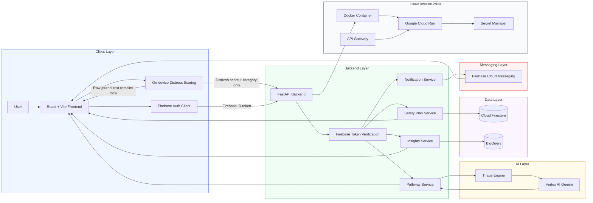

## Architecture

MindBridge uses a privacy-first architecture where sensitive journal content is processed locally in the browser. The backend receives only minimal distress metadata when additional support is needed.

### Data Flow

| Step | Description |
|---|---|
| 1 | The user interacts with the React frontend. |
| 2 | Journal text is analyzed locally using browser-side distress scoring. |
| 3 | Raw journal text remains on the device and is not sent to the backend. |
| 4 | If the distress threshold is reached, only distress metadata is sent to FastAPI. |
| 5 | Firebase ID tokens are verified by the backend middleware. |
| 6 | Vertex AI generates a structured support pathway through the triage service. |
| 7 | Firestore stores user-specific safety plan data. |
| 8 | BigQuery stores anonymized aggregate distress events. |
| 9 | Firebase Cloud Messaging sends notifications when required. |
| 10 | The backend runs as a Dockerized service on Google Cloud Run. |

### Component Responsibilities

| Component | Responsibility |
|---|---|
| React Frontend | User interface, authentication flow, local distress scoring, protected routes |
| Firebase Authentication | User sign-in, session handling, ID token generation |
| FastAPI Backend | API routing, request validation, service orchestration |
| Firebase Auth Middleware | Backend-side verification of Firebase ID tokens |
| Triage Engine | Converts distress metadata into structured AI prompts |
| Vertex AI | Generates personalized support pathway responses |
| Firestore | Stores user safety plans and user-specific structured data |
| BigQuery | Stores anonymized events for aggregate community insights |
| Firebase Cloud Messaging | Sends notification messages to registered clients |
| Cloud Run | Hosts the containerized FastAPI backend |
| API Gateway | Provides managed API routing for production deployment |
| Secret Manager | Stores production credentials and sensitive configuration |
